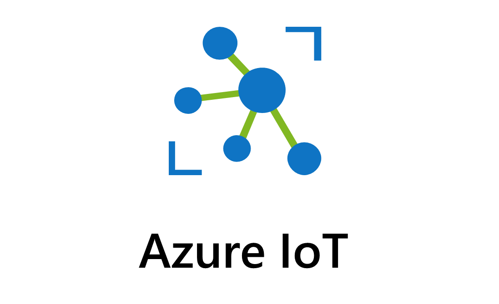

#

    </img>

# Azure IoT Connection Diagnostic Tool

The Azure IoT Connection Diagnostic Tool enables developers to easily diagnose connection issues between their system and their IoT device.

### Why Azure IoT?

**[Click here](https://azure.microsoft.com/en-us/solutions/iot/)** to learn how Azure IoT can empower the digital transformation of your organization.

### New to Azure IoT Hub?

**[Introduction to Azure IoT Hub:](https://github.com/Azure/azure-iot-device-ecosystem/blob/master/setup_iothub.md)** Follow this guide to learn how to set up an IoT Hub and IoT Hub devices.

## Contributing

This project welcomes contributions and suggestions.  Most contributions require you to agree to a
Contributor License Agreement (CLA) declaring that you have the right to, and actually do, grant us
the rights to use your contribution. For details, visit https://cla.opensource.microsoft.com.

When you submit a pull request, a CLA bot will automatically determine whether you need to provide
a CLA and decorate the PR appropriately (e.g., status check, comment). Simply follow the instructions
provided by the bot. You will only need to do this once across all repos using our CLA.

This project has adopted the [Microsoft Open Source Code of Conduct](https://opensource.microsoft.com/codeofconduct/).
For more information see the [Code of Conduct FAQ](https://opensource.microsoft.com/codeofconduct/faq/) or
contact [opencode@microsoft.com](mailto:opencode@microsoft.com) with any additional questions or comments.

## Trademarks

This project may contain trademarks or logos for projects, products, or services. Authorized use of Microsoft 
trademarks or logos is subject to and must follow 
[Microsoft's Trademark & Brand Guidelines](https://www.microsoft.com/en-us/legal/intellectualproperty/trademarks/usage/general).
Use of Microsoft trademarks or logos in modified versions of this project must not cause confusion or imply Microsoft sponsorship.
Any use of third-party trademarks or logos are subject to those third-party's policies.
